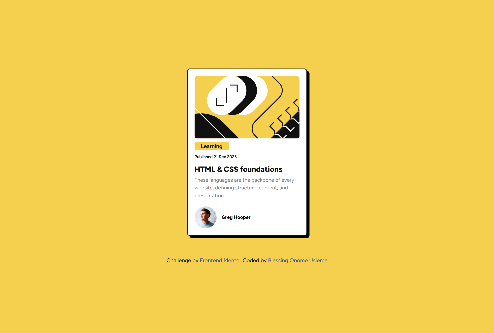
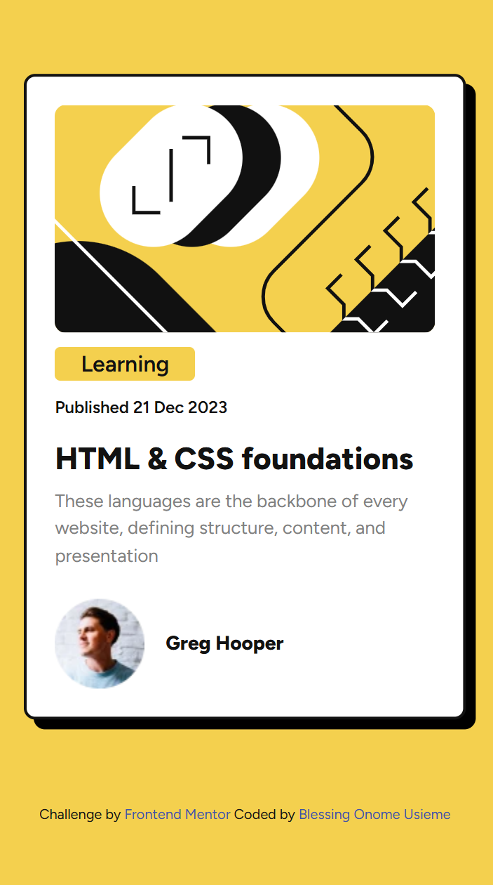

# Frontend Mentor - Blog preview card solution

This is a solution to the [Blog preview card challenge on Frontend Mentor](https://www.frontendmentor.io/challenges/blog-preview-card-ckPaj01IcS). Frontend Mentor challenges help you improve your coding skills by building realistic projects.

# Short description of my solution

This is a HTML & CSS-only challenge perfect project for beginners getting up to speed with HTML and CSS fundamentals, like HTML structure and the box model.

## Table of contents

-   [Frontend Mentor - Blog preview card solution](#frontend-mentor---blog-preview-card-solution)
-   [Short description of my solution](#short-description-of-my-solution)
    -   [Table of contents](#table-of-contents)
    -   [Overview](#overview)
        -   [The challenge](#the-challenge)
        -   [Screenshot](#screenshot)
        -   [Links](#links)
    -   [My process](#my-process)
        -   [Built with](#built-with)
        -   [What I learned](#what-i-learned)
        -   [Continued development](#continued-development)
        -   [Useful resources](#useful-resources)
    -   [Author](#author)
    -   [Acknowledgments](#acknowledgments)

## Overview

### The challenge

Users should be able to:

-   See hover and focus states for all interactive elements on the page

### Screenshot

### Links

-   Solution URL: [Github repo link](https://github.com/usiemeblessing/blog-review-card)
-   Live Site URL: [Live site at Netlify](usiemeblessing-blog-review-card)

## My process

I began by analyzing the design and setting up the project structure. I then wrote the HTML to structure the content semantically, followed by CSS to style the component and center it on the page, I wrote the media query to adapt to the specified screen size of 375px. Finally, I refined the layout to match the design as closely as possible both on the desktop and mobile view.

### Built with

-   Semantic HTML5 markup
-   CSS custom properties
-   Flexbox
-   Desktop-first workflow

### What I learned

-   Learnt more about the HTML structure
-   Learnt more about the box model.
-   Learnt more about flexbox.

### Continued development

-   I’d like to continue learning how to write clean, semantic HTML that improves accessibility and structure.
-   I want to continue improving my ability to create fully responsive components that adapt well to various screen sizes using CSS media queries and flexible layout techniques.
-   I want to sharpen my eye for design precision, focusing on replicating layouts as closely as possible to improve attention to detail.

### Useful resources

-   (https://www.youtube.com/watch?v=zutb5Clb_0Y&t=1123s) - This Youtube channel taught HTML in detail and greatly helped me gain valuable knowledge on HTML. I really liked the tutorial and will recommend it to anyone just starting off their web development journey.
-   (https://www.youtube.com/watch?v=-G-zic_LS0A) - This Youtube channel taught CSS in detail and greatly helped me gain valuable knowledge on CSS. Especially in the concept of flexbox.

## Author

-   Frontend Mentor - [@usiemeblessing](https://www.frontendmentor.io/profile/usiemeblesssing)

## Acknowledgments

I would like to acknowledge the Future Fullstack YouTube channel for providing clear and valuable HTML and CSS tutorials that contributed greatly to my understanding during this project.
